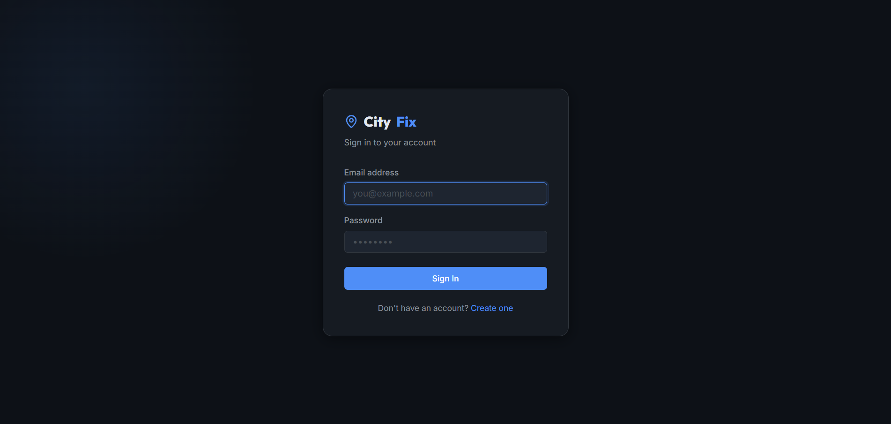
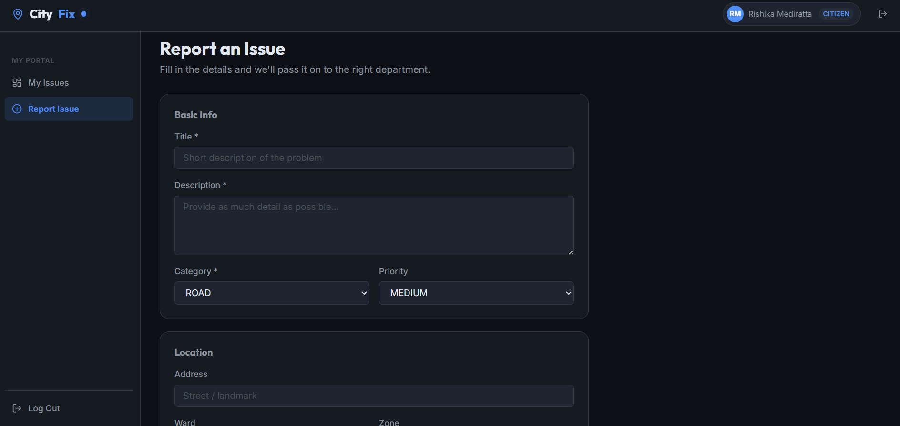
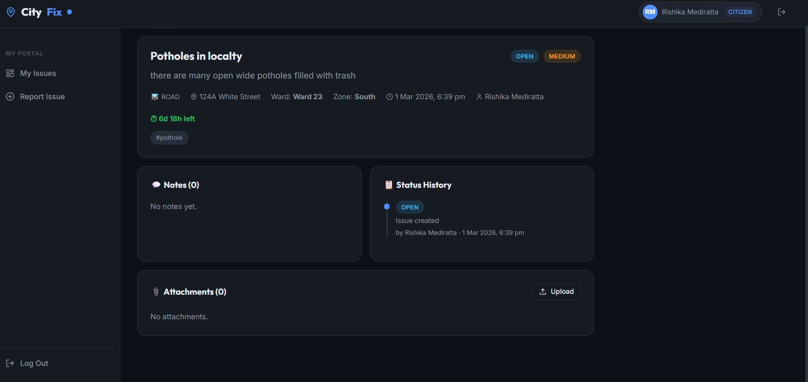
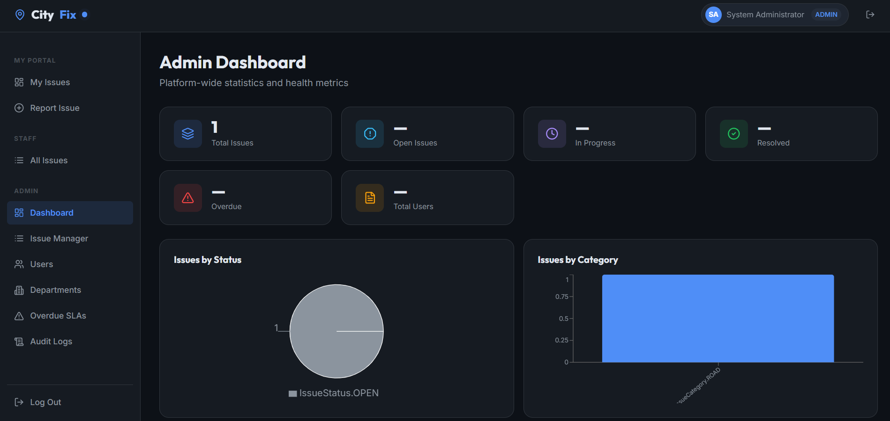
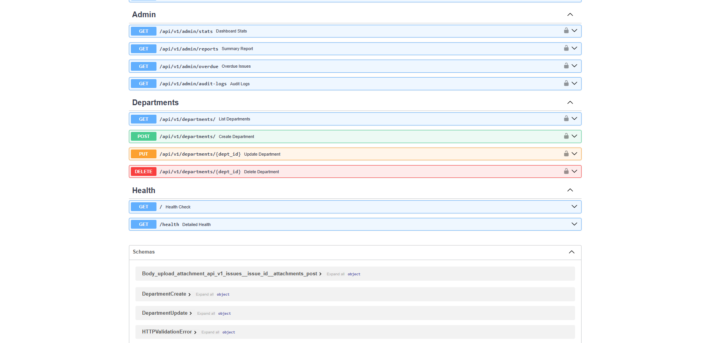
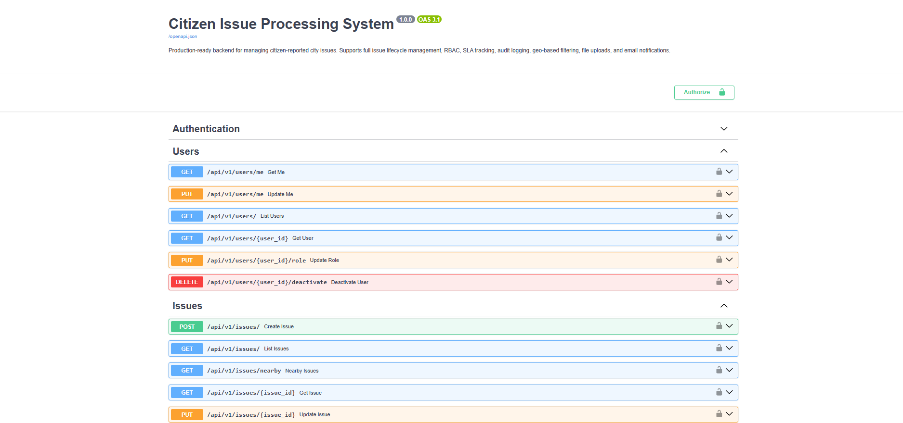

# Citizen Issue Processing System

A **production-ready** full-stack system for managing citizen-reported city issues (roads, drainage, electricity, sanitation, etc.). Built with FastAPI (backend) and React + Vite (frontend).

---

## 🚀 Features

- **JWT Authentication** – Secure login with access + refresh tokens
- **Role-Based Access Control** – CITIZEN / STAFF / ADMIN roles
- **Full Issue Lifecycle** – OPEN → IN_PROGRESS → RESOLVED → CLOSED with history tracking
- **Priority & SLA Tracking** – Auto-computed deadlines; overdue detection
- **Geo-based Filtering** – Filter by ward/zone; nearby duplicate detection
- **File Uploads** – Local filesystem (dev) or AWS S3 (prod)
- **Email Notifications** – Async SMTP on issue creation and status change
- **Audit Logging** – All write operations logged to the database
- **Rate Limiting** – Per-IP limits on sensitive endpoints
- **Swagger UI** – Auto-generated interactive API docs at `/docs`

---

## 📸 Screenshots & Assets

### Frontend UI Screenshots

#### Authentication Pages

**Sign In**



Sign in with email and password. Default admin account:

- Email: `admin@cityissues.gov`
- Password: `Admin@123456`

---

#### Report Issue

**Create New Issue**



Geo-enabled form to report city issues with:

- Issue title and description
- Category selection (Road, Water, Electricity, etc.)
- Priority level assignment
- Location mapping
- File attachments

---

#### Issue Management

**View Issues**



Browse and manage reported issues with:

- Filterable issue list
- Detailed issue information
- Status history tracking
- Internal notes and comments
- File attachments
- Location-based filtering

---

#### Admin Dashboard

**Admin Panel Overview**



Complete system management interface featuring:

- Dashboard statistics and analytics
- User management and role assignment
- Department configuration
- Audit logs and activity tracking
- SLA monitoring and overdue tracking
- Issue assignment and status management
- Performance reports and metrics

### API Assets

#### OpenAPI/Swagger Documentation

**API Endpoint Examples**





Full API documentation available at:

- **Swagger UI:** http://localhost:8000/docs
- **ReDoc:** http://localhost:8000/redoc
- **OpenAPI JSON:** http://localhost:8000/openapi.json

Features:

- **Interactive API Explorer** – Test endpoints directly from browser
- **Request/Response Examples** – See exact data formats
- **Authentication UI** – Authorize with JWT tokens
- **ReDoc Alternative** – Beautiful, searchable documentation

#### Entity Diagrams

**User Roles & Permissions**

```
┌─────────────┐
│   CITIZEN   │ - Report issues, view own issues
├─────────────┤
│   STAFF     │ - Assign, update, resolve issues, add notes
├─────────────┤
│   ADMIN     │ - Full system access, user & department management
└─────────────┘
```

**Issue Lifecycle**

```
┌─────────┐    ┌──────────────┐    ┌──────────┐    ┌───────┐
│  OPEN   │──▶ │ IN_PROGRESS  │──▶ │ RESOLVED │──▶ │ CLOSED│
└─────────┘    └──────────────┘    └──────────┘    └───────┘
     ▲                                    │
     └────────────────────────────────────┘
            (Can reopen if needed)
```

**Priority & SLA Matrix**

```
Priority  │ SLA Duration │ Color
──────────┼──────────────┼──────
CRITICAL  │ 1 day        │ 🔴 Red
HIGH      │ 3 days       │ 🟠 Orange
MEDIUM    │ 7 days       │ 🟡 Yellow
LOW       │ 14 days      │ 🟢 Green
```

### Data Schemas

**User Model**

```json
{
  "id": "uuid",
  "email": "user@example.com",
  "full_name": "John Doe",
  "phone": "+91 98765 43210",
  "role": "CITIZEN|STAFF|ADMIN",
  "is_active": true,
  "created_at": "2026-03-01T10:00:00Z",
  "updated_at": "2026-03-01T10:00:00Z"
}
```

**Issue Model**

```json
{
  "id": "uuid",
  "title": "Pothole on Main Street",
  "description": "Large pothole causing traffic issues...",
  "category": "ROAD",
  "status": "OPEN",
  "priority": "HIGH",
  "latitude": 28.6139,
  "longitude": 77.2090,
  "address": "Main Street, Ward 5",
  "ward": "Ward 5",
  "zone": "North",
  "reported_by": {...user...},
  "assigned_to": {...user...},
  "sla_deadline": "2026-03-03T10:00:00Z",
  "resolved_at": null,
  "created_at": "2026-03-01T10:00:00Z",
  "updated_at": "2026-03-01T10:00:00Z"
}
```

### Media Assets Directory Structure

```
frontend/public/
├── assets/
│   ├── images/
│   │   ├── logo.png              # Application logo
│   │   ├── hero.jpg              # Landing page hero image
│   │   └── icons/
│   │       ├── issue.svg          # Issue icons
│   │       ├── user.svg           # User avatar icon
│   │       └── department.svg     # Department icon
│   └── fonts/
│       ├── inter.woff2            # Primary font
│       └── mono.woff2             # Code font
```

---

## 🏗️ Project Structure

```
FastApi/
├── backend/                  # FastAPI backend
│   ├── app/
│   │   ├── api/v1/routes/   # Route handlers (auth, users, issues, admin, departments)
│   │   ├── core/            # Config, security, exceptions, response helpers, logging
│   │   ├── db/              # SQLAlchemy base & session
│   │   ├── middleware/      # Audit logging, rate limiting
│   │   ├── models/          # SQLAlchemy ORM models
│   │   ├── schemas/         # Pydantic v2 schemas
│   │   ├── services/        # Business logic layer
│   │   └── main.py          # FastAPI app initialization
│   ├── alembic/             # Database migrations
│   ├── tests/               # Backend tests
│   ├── .env                 # Backend configuration
│   ├── requirements.txt     # Python dependencies
│   └── alembic.ini          # Alembic configuration
│
├── frontend/                # React + Vite frontend
│   ├── src/
│   │   ├── api/            # API client functions
│   │   ├── components/     # Reusable React components
│   │   ├── pages/          # Page components
│   │   ├── context/        # React Context (Auth)
│   │   ├── styles/         # CSS stylesheets
│   │   └── App.jsx         # Root React component
│   ├── public/             # Static assets
│   ├── package.json        # Node dependencies
│   └── vite.config.js      # Vite configuration
│
├── .env.example            # Example environment variables
├── .gitignore
└── README.md              # This file
```

---

## ⚙️ Tech Stack

### Backend

| Component  | Technology                           |
| ---------- | ------------------------------------ |
| Framework  | FastAPI 0.111                        |
| ORM        | SQLAlchemy 2.0                       |
| Database   | SQLite (dev) / PostgreSQL (prod)     |
| Migrations | Alembic                              |
| Auth       | JWT (python-jose) + bcrypt (passlib) |
| Validation | Pydantic v2                          |
| Testing    | pytest + httpx                       |

### Frontend

| Component  | Technology      |
| ---------- | --------------- |
| Framework  | React 18        |
| Build Tool | Vite 7          |
| Router     | React Router v6 |
| Charts     | Recharts        |
| Icons      | Lucide React    |

---

## 🚀 Getting Started

### Prerequisites

- Python 3.11+
- Node.js 18+
- npm or yarn

### Installation

#### 1. Clone the repository

```bash
git clone <repo-url>
cd FastApi
```

#### 2. Set up Backend

```bash
cd backend

# Create virtual environment
python -m venv venv

# Activate virtual environment
# On Windows:
venv\Scripts\activate
# On macOS/Linux:
source venv/bin/activate

# Install dependencies
pip install -r requirements.txt

# Run migrations
python -m alembic upgrade head

# Start backend server
python -m uvicorn app.main:app --reload --port 8000
```

Backend will be available at `http://localhost:8000`

#### 3. Set up Frontend

```bash
cd ../frontend

# Install dependencies
npm install

# Start development server
npm run dev
```

Frontend will be available at `http://localhost:5173` (or next available port)

---

## 🔐 Default Admin Credentials

| Field    | Value                |
| -------- | -------------------- |
| Email    | admin@cityissues.gov |
| Password | Admin@123456         |

> ⚠️ Change these credentials in production!

---

## 📚 API Documentation

Once backend is running, visit:

- **Swagger UI:** http://localhost:8000/docs
- **ReDoc:** http://localhost:8000/redoc

---

## 🧪 Testing

```bash
cd backend

# Run all tests
pytest

# Run with coverage
pytest --cov=app

# Run specific test file
pytest tests/test_auth.py
```

---

## 🔧 Configuration

### Backend (.env)

│ ├── services/ # Business logic layer
│ ├── dependencies.py # Auth & RBAC FastAPI dependencies
│ └── main.py # App entry point
├── alembic/ # Migrations
├── tests/ # Pytest test suite
├── .env.example
├── requirements.txt
└── README.md

````

---

## ⚙️ Setup

### 1. Clone & create virtual environment

```bash
cd /Users/rickyk/Coding/FastApi
python -m venv venv
source venv/bin/activate  # Windows: venv\Scripts\activate
````

### 2. Install dependencies

```bash
pip install -r requirements.txt
```

### 3. Configure environment

```bash
cp .env.example .env
```

Edit `.env` and set:

- `DATABASE_URL` – your PostgreSQL connection string
- `SECRET_KEY` – a random 256-bit secret (use `openssl rand -hex 32`)
- `MAIL_*` settings if you want email notifications (set `MAIL_ENABLED=true`)
- `STORAGE_BACKEND=s3` + AWS credentials if you want S3 uploads

### 4. Create the database

```bash
# Ensure your PostgreSQL instance is running and the database exists
createdb cityissues
```

### 5. Run Alembic migrations

```bash
alembic revision --autogenerate -m "Initial schema"
alembic upgrade head
```

### 6. Start the server

```bash
uvicorn app.main:app --reload
```

The server will:

- Start at **http://127.0.0.1:8000**
- Auto-create the `uploads/` directory
- **Seed the first admin user** from `FIRST_ADMIN_EMAIL` + `FIRST_ADMIN_PASSWORD` in `.env`

---

## 📖 API Documentation

| URL                                | Description              |
| ---------------------------------- | ------------------------ |
| http://127.0.0.1:8000/docs         | Swagger UI (interactive) |
| http://127.0.0.1:8000/redoc        | ReDoc documentation      |
| http://127.0.0.1:8000/openapi.json | OpenAPI schema           |

---

## 🔑 API Quick Reference

### Authentication

| Method | Endpoint                | Auth | Description          |
| ------ | ----------------------- | ---- | -------------------- |
| POST   | `/api/v1/auth/register` | ❌   | Register a citizen   |
| POST   | `/api/v1/auth/login`    | ❌   | Login (returns JWT)  |
| POST   | `/api/v1/auth/refresh`  | ❌   | Refresh access token |

### Users

| Method | Endpoint                  | Auth  | Description      |
| ------ | ------------------------- | ----- | ---------------- |
| GET    | `/api/v1/users/me`        | ✅    | Get own profile  |
| PUT    | `/api/v1/users/me`        | ✅    | Update profile   |
| GET    | `/api/v1/users/`          | ADMIN | List all users   |
| PUT    | `/api/v1/users/{id}/role` | ADMIN | Change user role |

### Issues

| Method | Endpoint                          | Auth        | Description                 |
| ------ | --------------------------------- | ----------- | --------------------------- |
| POST   | `/api/v1/issues/`                 | ✅          | Create issue                |
| GET    | `/api/v1/issues/`                 | ✅          | List/filter/paginate issues |
| GET    | `/api/v1/issues/nearby`           | ✅          | Find nearby open issues     |
| GET    | `/api/v1/issues/{id}`             | ✅          | Get issue detail            |
| PUT    | `/api/v1/issues/{id}`             | STAFF/ADMIN | Update issue                |
| DELETE | `/api/v1/issues/{id}`             | STAFF/ADMIN | Delete issue                |
| POST   | `/api/v1/issues/{id}/status`      | STAFF/ADMIN | Change status               |
| GET    | `/api/v1/issues/{id}/history`     | ✅          | Status history              |
| POST   | `/api/v1/issues/{id}/notes`       | STAFF/ADMIN | Add internal note           |
| GET    | `/api/v1/issues/{id}/notes`       | ✅          | List notes                  |
| POST   | `/api/v1/issues/{id}/attachments` | ✅          | Upload file                 |
| GET    | `/api/v1/issues/{id}/attachments` | ✅          | List attachments            |

### Admin

| Method | Endpoint                   | Auth  | Description          |
| ------ | -------------------------- | ----- | -------------------- |
| GET    | `/api/v1/admin/stats`      | ADMIN | Dashboard statistics |
| GET    | `/api/v1/admin/reports`    | ADMIN | Date-range summary   |
| GET    | `/api/v1/admin/overdue`    | ADMIN | SLA-breached issues  |
| GET    | `/api/v1/admin/audit-logs` | ADMIN | Full audit trail     |

### Filtering Issues

Query parameters for `GET /api/v1/issues/`:

| Parameter    | Type         | Description                                                                                                |
| ------------ | ------------ | ---------------------------------------------------------------------------------------------------------- |
| `category`   | enum         | ROAD, WATER, ELECTRICITY, GARBAGE, DRAINAGE, STREETLIGHT, PARK, PUBLIC_TRANSPORT, SANITATION, NOISE, OTHER |
| `status`     | enum         | OPEN, IN_PROGRESS, RESOLVED, CLOSED                                                                        |
| `priority`   | enum         | LOW, MEDIUM, HIGH, CRITICAL                                                                                |
| `ward`       | string       | Filter by ward name                                                                                        |
| `zone`       | string       | Filter by zone                                                                                             |
| `search`     | string       | Full-text search in title/description/address                                                              |
| `date_from`  | ISO datetime | Filter by creation date                                                                                    |
| `date_to`    | ISO datetime | Filter by creation date                                                                                    |
| `page`       | int          | Page number (default: 1)                                                                                   |
| `page_size`  | int          | Items per page (default: 20, max: 100)                                                                     |
| `sort_by`    | string       | Field to sort by (default: created_at)                                                                     |
| `sort_order` | asc/desc     | Sort direction                                                                                             |

---

## 🧪 Running Tests

```bash
pytest tests/ -v
```

Test coverage includes:

- **Auth**: register, login, token refresh, duplicate email, weak password
- **Issues**: create, list, filter, get by ID, pagination, status history, nearby
- **Admin**: stats, reports, overdue, audit logs, department management
- **RBAC**: citizen permission boundaries, unauthenticated rejections

> Tests use an **in-memory SQLite database** — no PostgreSQL required for testing.

---

## 📊 Standard Response Format

All endpoints return:

```json
{
  "success": true,
  "data": {},
  "message": "Issue created successfully"
}
```

Paginated responses include:

```json
{
  "success": true,
  "data": {
    "items": [],
    "total": 150,
    "page": 1,
    "page_size": 20,
    "pages": 8
  },
  "message": "Success"
}
```

---

## 🔐 SLA Thresholds (configurable via `.env`)

| Priority | SLA     |
| -------- | ------- |
| CRITICAL | 1 day   |
| HIGH     | 3 days  |
| MEDIUM   | 7 days  |
| LOW      | 14 days |

---

## 🗄️ Database Migrations

```bash
# Create a new migration after model changes
alembic revision --autogenerate -m "description"

# Apply migrations
alembic upgrade head

# Rollback one step
alembic downgrade -1
```
